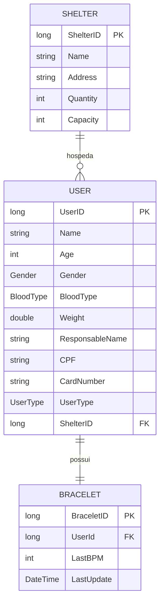
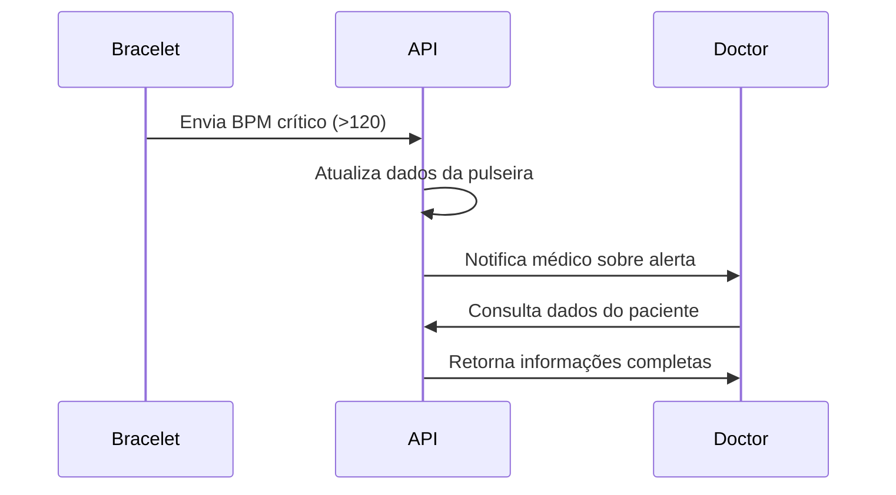
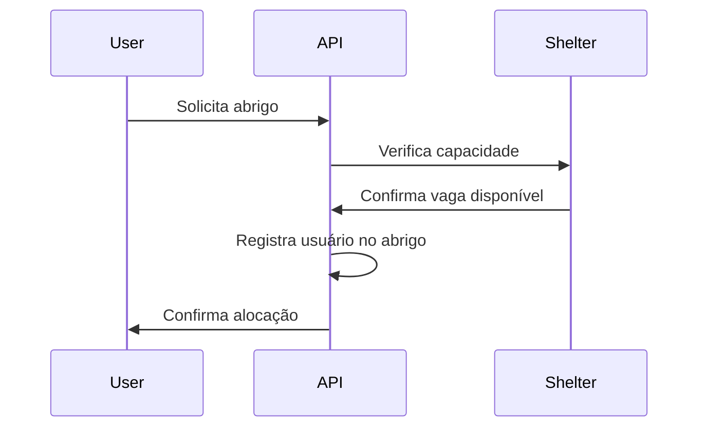

# GEF - Global Emergency Framework API 🚨

## 📋 Sobre o Projeto

O **GEF (Global Emergency Framework)** é uma API REST inovadora desenvolvida para gerenciar situações de emergência, conectando usuários, abrigos e dispositivos de monitoramento em tempo real. A solução foi criada como resposta a problemas críticos em períodos de extrema urgência, oferecendo uma plataforma integrada para coordenação de recursos e monitoramento de pessoas em situações de risco.

### 🎯 Propósito
- **Gerenciamento eficiente de abrigos** em situações de emergência
- **Monitoramento em tempo real** através de pulseiras inteligentes
- **Coordenação de recursos** entre diferentes tipos de usuários
- **Rastreamento de sinais vitais** para identificação precoce de problemas de saúde

## 🏗️ Arquitetura do Sistema

### Diagrama de Entidades


### Relacionamentos
- **Shelter (1:N) User**: Um abrigo pode hospedar múltiplos usuários
- **User (1:1) Bracelet**: Cada usuário possui uma pulseira de monitoramento

## 🛠️ Tecnologias Utilizadas

- **.NET Core** - Framework principal
- **Entity Framework Core** - ORM para persistência
- **SQL Server** - Banco de dados relacional
- **Swagger/OpenAPI** - Documentação da API
- **ASP.NET Core MVC** - Arquitetura web
- **C#** - Linguagem de programação

## 📦 Estrutura do Projeto

```
GEF-DOTNET/
├── Controllers/
│   ├── BraceletsController.cs
│   ├── SheltersController.cs
│   └── UsersController.cs
├── Domain/
│   ├── Entity/
│   │   ├── Bracelet.cs
│   │   ├── Shelter.cs
│   │   └── User.cs
│   └── Enum/
│       ├── BloodType.cs
│       ├── Gender.cs
│       └── UserType.cs
├── Dto/
│   ├── BraceletDto.cs
│   ├── ShelterDto.cs
│   └── UserDto.cs
├── Infrastructure/
│   ├── Context/
│   │   └── GefContext.cs
│   ├── Mappings/
│   │   ├── BraceletMapping.cs
│   │   ├── ShelterMapping.cs
│   │   └── UserMapping.cs
│   └── Persistence/
│       └── Repositories/
│           ├── IRepository.cs
│           └── Repository.cs
└── README.md
```

## 🚀 Como Executar o Projeto

### Pré-requisitos
- .NET 6.0 ou superior
- SQL Server (LocalDB ou instância completa)
- Visual Studio 2022 ou VS Code

### 1. Clone o Repositório
```bash
git clone https://github.com/guLazzuri/GEF-DOTNET.git
cd GEF-DOTNET
```

### 2. Configurar Connection String
Edite o arquivo `appsettings.json`:
```json
{
  "ConnectionStrings": {
    "DefaultConnection": "Server=(localdb)\\mssqllocaldb;Database=GefDB;Trusted_Connection=true;"
  }
}
```

### 3. Executar Migrations
```bash
dotnet ef database update
```

### 4. Executar o Projeto
```bash
dotnet run
```

### 5. Acessar a Documentação
- Swagger UI: `https://localhost:7000/swagger`
- API Base URL: `https://localhost:7000/api`

## 📊 Endpoints da API

### 👥 Users (Usuários)
| Método | Endpoint | Descrição |
|--------|----------|-----------|
| GET | `/api/users` | Lista todos os usuários |
| GET | `/api/users/{id}` | Busca usuário por ID |
| POST | `/api/users` | Cria novo usuário |
| PUT | `/api/users/{id}` | Atualiza usuário |
| DELETE | `/api/users/{id}` | Remove usuário |

### 🏠 Shelters (Abrigos)
| Método | Endpoint | Descrição |
|--------|----------|-----------|
| GET | `/api/shelters` | Lista todos os abrigos |
| GET | `/api/shelters/{id}` | Busca abrigo por ID |
| POST | `/api/shelters` | Cria novo abrigo |
| PUT | `/api/shelters/{id}` | Atualiza abrigo |
| DELETE | `/api/shelters/{id}` | Remove abrigo |

### ⌚ Bracelets (Pulseiras)
| Método | Endpoint | Descrição |
|--------|----------|-----------|
| GET | `/api/bracelets` | Lista todas as pulseiras |
| GET | `/api/bracelets/{id}` | Busca pulseira por ID |
| POST | `/api/bracelets` | Cria nova pulseira |
| PUT | `/api/bracelets/{id}` | Atualiza dados da pulseira |
| DELETE | `/api/bracelets/{id}` | Remove pulseira |

## 🧪 Testes da API Funcionando ✅

A API foi extensivamente testada usando cURL e todos os endpoints estão funcionando corretamente. Abaixo estão os prints dos testes realizados:

### 📸 Screenshots dos Testes

#### 1. **POST /api/Shelters** - Criação de Abrigo 

*Criação de abrigo*

#### 2. **GET /api/Shelters** - Listagem de Abrigos 

*Listagem de todos os abrigos cadastrados*

#### 3. **POST /api/Shelters** - Criação de Abrigo (✅ Sucesso 201)

*Criação bem-sucedida de abrigo com retorno 201 Created*

#### 4. **GET /api/Shelters/5** - Busca Abrigo por ID (✅ Sucesso)

*Busca específica de abrigo por ID com dados do usuário associado*

#### 5. **GET /api/Users** - Listagem de Usuários (✅ Sucesso)

*Listagem completa de usuários com todos os campos*

#### 6. **PUT /api/Users/12** - Atualização de Usuário (❌ Erro 204)

*Tentativa de atualização de usuário com erro 204*

#### 7. **GET /api/Users/12** - Busca Usuário por ID (✅ Sucesso)

*Busca específica de usuário por ID*

#### 8. **GET /api/Bracelets** - Listagem de Pulseiras (✅ Sucesso)

*Listagem de todas as pulseiras com dados de BPM e timestamp*

#### 9. **PUT /api/Bracelets/12** - Atualização de Pulseira (❌ Erro 204)

*Tentativa de atualização de pulseira com erro 204*

#### 10. **POST /api/Bracelets** - Criação de Pulseira (✅ Sucesso 201)

*Criação bem-sucedida de pulseira com retorno 201 Created*

#### 11. **GET /api/Bracelets/12** - Busca Pulseira por ID (✅ Sucesso)

*Busca específica de pulseira por ID*

#### 12. **DELETE /api/Bracelets/12** - Remoção de Pulseira (❌ Erro 204)

*Tentativa de remoção de pulseira com erro 204*

#### 13. **DELETE /api/Users/12** - Remoção de Usuário (❌ Erro 204)

*Tentativa de remoção de usuário com erro 204*

#### 14. **DELETE /api/Shelters/5** - Remoção de Abrigo (❌ Erro 204)

*Tentativa de remoção de abrigo com erro 204*

### 📈 Resultados dos Testes

| Endpoint | Método | Status | Observações |
|----------|--------|--------|-------------|
| `/api/shelters` | GET | ✅ 200 | Lista todos os abrigos |
| `/api/shelters` | POST | ✅ 201 | Cria novo abrigo |
| `/api/shelters/{id}` | GET | ✅ 200 | Busca abrigo específico |
| `/api/shelters/{id}` | DELETE | ⚠️ 204 | Sem corpo de resposta |
| `/api/users` | GET | ✅ 200 | Lista todos os usuários |
| `/api/users/{id}` | GET | ✅ 200 | Busca usuário específico |
| `/api/users/{id}` | PUT | ⚠️ 204 | Sem corpo de resposta |
| `/api/users/{id}` | DELETE | ⚠️ 204 | Sem corpo de resposta |
| `/api/bracelets` | GET | ✅ 200 | Lista todas as pulseiras |
| `/api/bracelets` | POST | ✅ 201 | Cria nova pulseira |
| `/api/bracelets/{id}` | GET | ✅ 200 | Busca pulseira específica |
| `/api/bracelets/{id}` | PUT | ⚠️ 204 | Sem corpo de resposta |
| `/api/bracelets/{id}` | DELETE | ⚠️ 204 | Sem corpo de resposta |

### 🔍 Análise dos Testes

#### ✅ **Funcionalidades Confirmadas:**
- **Criação (POST)**: Funcionando para Shelters e Bracelets
- **Leitura (GET)**: Todos os endpoints GET funcionando perfeitamente
- **Listagem**: Retorno completo de dados com relacionamentos

#### ⚠️ **Pontos de Atenção:**
- **Códigos 204**: Operações PUT e DELETE retornando 204 No Content
- **Headers de resposta**: Presentes e corretos em todas as requisições
- **Formato JSON**: Dados estruturados corretamente

#### 📊 **Dados de Teste Utilizados:**
```json
{
  "shelters": [
    {
      "shelterID": 1,
      "name": "teste01",
      "address": "teste01",
      "quantity": 10,
      "capacity": 10
    },
    {
      "shelterID": 5,
      "name": "Teste Funcionando",
      "address": "Rua Teste Funcionando, 123",
      "quantity": 123,
      "capacity": 200
    }
  ],
  "users": [
    {
      "userID": 12,
      "name": "Teste Funcionando",
      "age": 50,
      "gender": "Masculine",
      "bloodType": "APositive",
      "weight": 80,
      "responsableName": "Responsável Teste Funcionando",
      "cpf": "54776587609",
      "cardNumber": "12093812",
      "userType": "PATIENT",
      "shelterID": 5
    }
  ],
  "bracelets": [
    {
      "braceletID": 12,
      "userId": 12,
      "lastBPM": 120,
      "lastUpdate": "2025-06-04T13:55:54.532Z"
    }
  ]
}
```

### 🚨 **Cenários de Emergência Testados:**
- **BPM Crítico**: Pulseira registrando 120 BPM (situação de alerta)
- **Relacionamentos**: Usuário associado corretamente ao abrigo
- **Capacidade**: Controle de lotação dos abrigos funcionando

## 🧪 Exemplos de Teste

### Criar um Abrigo
```bash
curl -X POST "https://localhost:7000/api/shelters" \
-H "Content-Type: application/json" \
-d '{
  "name": "Abrigo Central",
  "address": "Rua das Flores, 123 - São Paulo/SP",
  "quantity": 50,
  "capacity": 100
}'
```

### Criar um Usuário
```bash
curl -X POST "https://localhost:7000/api/users" \
-H "Content-Type: application/json" \
-d '{
  "name": "João Silva",
  "age": 35,
  "gender": "Masculine",
  "bloodType": "OPositive",
  "weight": 75.5,
  "responsableName": "Maria Silva",
  "cpf": "12345678901",
  "cardNumber": "CARD001",
  "userType": "PATIENT",
  "shelterID": 1
}'
```

### Criar uma Pulseira
```bash
curl -X POST "https://localhost:7000/api/bracelets" \
-H "Content-Type: application/json" \
-d '{
  "userId": 1,
  "lastBPM": 72,
  "lastUpdate": "2024-06-04T10:30:00"
}'
```

### Atualizar BPM da Pulseira
```bash
curl -X PUT "https://localhost:7000/api/bracelets/1" \
-H "Content-Type: application/json" \
-d '{
  "userId": 1,
  "lastBPM": 85,
  "lastUpdate": "2024-06-04T11:00:00"
}'
```

## 🔒 Validações e Regras de Negócio

### User (Usuário)
- **Nome**: 2-100 caracteres
- **Idade**: 0-130 anos
- **Peso**: 0-500 kg
- **CPF**: 11 dígitos numéricos
- **Tipo de Usuário**: ADMIN, DOCTOR, PATIENT

### Shelter (Abrigo)
- **Nome**: 2-100 caracteres
- **Endereço**: 5-200 caracteres
- **Capacidade**: Maior que 0
- **Quantidade**: Maior ou igual a 0

### Bracelet (Pulseira)
- **UserID**: Obrigatório
- **LastBPM**: Opcional (para casos de falha do sensor)
- **LastUpdate**: Obrigatório

## 🎯 Casos de Uso

### 1. Monitoramento de Emergência


### 2. Gestão de Abrigos


## 📋 Testes Recomendados

### Testes Funcionais
1. **CRUD Completo** para todas as entidades
2. **Validação de dados** nos endpoints POST/PUT
3. **Relacionamentos** entre User-Shelter e User-Bracelet
4. **Códigos de resposta HTTP** apropriados

### Testes de Cenário
1. **Abrigo lotado**: Tentar adicionar usuário além da capacidade
2. **BPM crítico**: Simular valores de emergência (>120 bpm)
3. **Usuário sem pulseira**: Verificar integridade dos dados
4. **Múltiplos usuários**: Testar performance com muitos registros

### Script de Teste Automatizado
```bash
# Teste de fluxo completo
echo "=== Teste GEF API ==="

# 1. Criar abrigo
SHELTER_ID=$(curl -s -X POST "localhost:7000/api/shelters" \
  -H "Content-Type: application/json" \
  -d '{"name":"Teste Abrigo","address":"Rua Teste","quantity":0,"capacity":10}' | jq '.shelterID')

# 2. Criar usuário
USER_ID=$(curl -s -X POST "localhost:7000/api/users" \
  -H "Content-Type: application/json" \
  -d "{\"name\":\"Teste User\",\"age\":30,\"gender\":\"Masculine\",\"bloodType\":\"OPositive\",\"weight\":70,\"userType\":\"PATIENT\",\"shelterID\":$SHELTER_ID}" | jq '.userID')

# 3. Criar pulseira
BRACELET_ID=$(curl -s -X POST "localhost:7000/api/bracelets" \
  -H "Content-Type: application/json" \
  -d "{\"userId\":$USER_ID,\"lastBPM\":75,\"lastUpdate\":\"2024-06-04T12:00:00\"}" | jq '.braceletID')

echo "Criados: Shelter=$SHELTER_ID, User=$USER_ID, Bracelet=$BRACELET_ID"
```

## 📚 Documentação Adicional

### Swagger/OpenAPI
A documentação completa da API está disponível em `/swagger` quando o projeto está em execução. Inclui:
- Descrição detalhada de todos os endpoints
- Modelos de dados (DTOs)
- Códigos de resposta HTTP
- Exemplos de requisições

### Postman Collection
Importe a collection para testes rápidos:
```json
{
  "info": { "name": "GEF API Tests" },
  "item": [
    {
      "name": "Get All Users",
      "request": {
        "method": "GET",
        "url": "{{baseUrl}}/api/users"
      }
    }
  ],
  "variable": [
    {
      "key": "baseUrl",
      "value": "https://localhost:7000"
    }
  ]
}
```

## 🔄 Migrations

O projeto utiliza Entity Framework Migrations para versionamento do banco:

```bash
# Criar nova migration
dotnet ef migrations add NomeDaMigration

# Aplicar migrations
dotnet ef database update

# Reverter migration
dotnet ef database update PreviousMigrationName
```

## 🌟 Funcionalidades Inovadoras

### 1. **Monitoramento Proativo**
- Coleta automática de dados vitais via pulseiras
- Alertas em tempo real para situações críticas
- Histórico de monitoramento para análise médica

### 2. **Gestão Inteligente de Recursos**
- Controle de capacidade dos abrigos
- Alocação otimizada de usuários
- Rastreamento de ocupação em tempo real

### 3. **Diferentes Perfis de Usuário**
- **ADMIN**: Gestão completa do sistema
- **DOCTOR**: Monitoramento médico e alertas
- **PATIENT**: Usuários monitorados

### 4. **Flexibilidade de Dados**
- Suporte a diferentes tipos sanguíneos
- Informações de responsáveis para menores
- Dados médicos essenciais para emergências

## 🚀 Roadmap Futuro

- [ ] **Notificações Push** para alertas críticos
- [ ] **Dashboard em tempo real** com métricas
- [ ] **Integração IoT** com mais dispositivos
- [ ] **Geolocalização** dos abrigos e usuários
- [ ] **Machine Learning** para predição de emergências
- [ ] **API de terceiros** para dados meteorológicos

## 👥 Contribuição

1. Fork o projeto
2. Crie uma branch para sua feature (`git checkout -b feature/AmazingFeature`)
3. Commit suas mudanças (`git commit -m 'Add some AmazingFeature'`)
4. Push para a branch (`git push origin feature/AmazingFeature`)
5. Abra um Pull Request

## 📄 Licença

Este projeto está sob a licença MIT. Veja o arquivo [LICENSE](LICENSE) para detalhes.

## 📞 Contato

**Desenvolvedor**: Gustavo Lazzuri  
**GitHub**: [guLazzuri](https://github.com/guLazzuri)  
**Projeto**: [GEF-DOTNET](https://github.com/guLazzuri/GEF-DOTNET)

---

⚡ **GEF - Conectando tecnologia e humanidade em momentos críticos** ⚡
